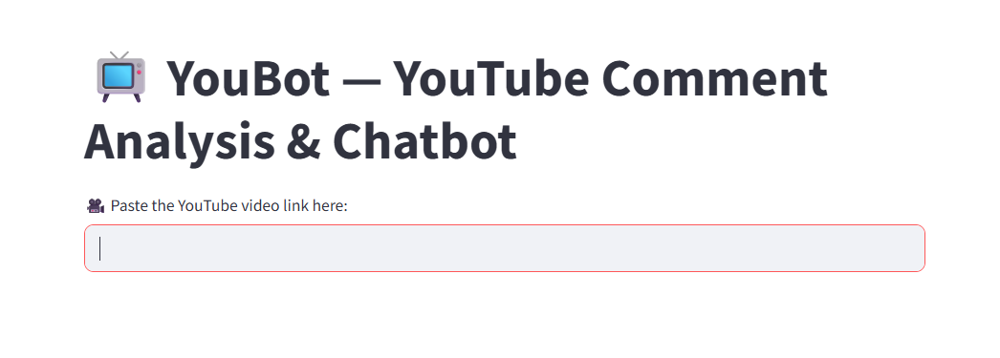
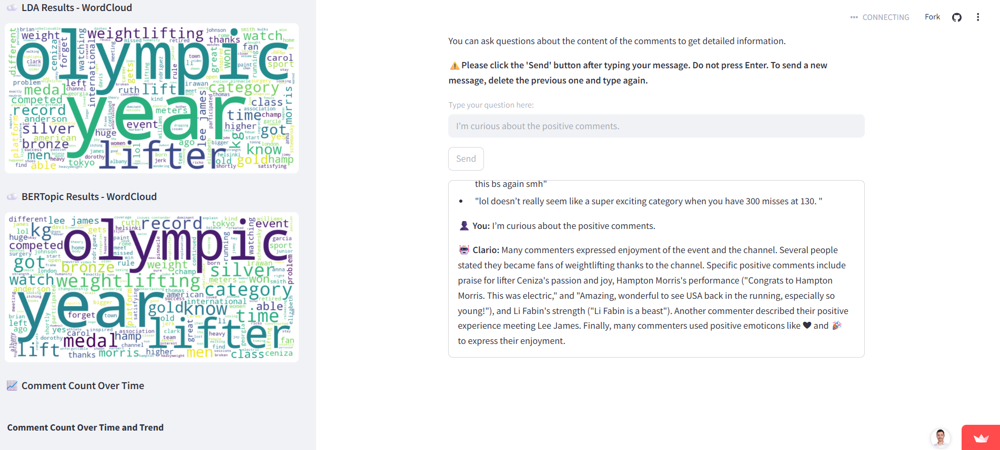
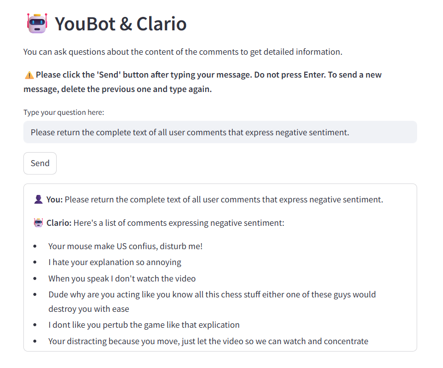

# 📺 YouBot — YouTube Comment Analysis & Chatbot

YouBot is a Streamlit-powered web application designed to help users analyze YouTube video comments using cutting-edge Natural Language Processing (NLP) techniques, including BERTopic and sentiment analysis (VADER & TextBlob).

In addition to exploratory data insights, YouBot features a conversational assistant powered by Google's Gemini 1.5 Flash model, integrated with a Retrieval-Augmented Generation (RAG) pipeline. This allows users to:

---
## 🌐 Live Demo

🖥️ Try the application here:  
👉 [https://youbot.streamlit.app/](https://youbot.streamlit.app/)

🖥️Read the full article on Medium:

👉 https://medium.com/@sercanteyhani/youbot-understanding-youtube-comments-and-chatting-intelligently-an-engineers-perspective-71fc82164a26

## ✨ Features

- **YouTube Comment Fetching:**  
  Easily retrieve comments from any public YouTube video by simply pasting its URL.

- **Dual Sentiment Analysis:**  
  - *TextBlob:* Provides a quick and intuitive sentiment breakdown (positive, neutral, negative).  
  - *VADER Sentiment:* A lexicon and rule-based sentiment analysis tool, especially effective for social media text.  
  Visualized with clear bar charts and interactive pie charts.

- **Topic Modeling:**  
  - *LDA (Latent Dirichlet Allocation):* Uncover prominent themes and topics within the comments.  
  - *BERTopic:* Leverage BERT embeddings to create more coherent and interpretable topics.  
  Visualize dominant words for each model using dynamic Word Clouds.

- **Comment Trend Analysis:**  
  See how comment activity evolves over time with a historical comment count chart, including moving averages and peak indicators.

- **AI Chatbot (Clario):**  
  - Powered by Google's Gemini-1.5-Flash model.  
  - Ask specific questions about the fetched comments and receive intelligent, context-aware answers.  
  - Ideal for quickly extracting information or summarizing common sentiments.

---

## 🛠️ Technologies Used

- Streamlit — For creating interactive web applications.  
- Python — The core programming language.  
- Pandas — For data manipulation and analysis.  
- Requests — For making HTTP requests to the YouTube Data API.  
- TextBlob & VADER Sentiment — For sentiment analysis.  
- SpaCy & NLTK — For natural language processing (tokenization, stop word removal).  
- Gensim (LDA) — For Latent Dirichlet Allocation topic modeling.  
- BERTopic — For advanced topic modeling using BERT embeddings.  
- Matplotlib, Seaborn, Plotly — For data visualization.  
- LangChain — For building the AI chatbot.  
- Google Gemini API — Powering the intelligent chatbot responses.  
- Google YouTube Data API v3 — For fetching YouTube comments.

  ## 📸 Project Screenshots

  

 
